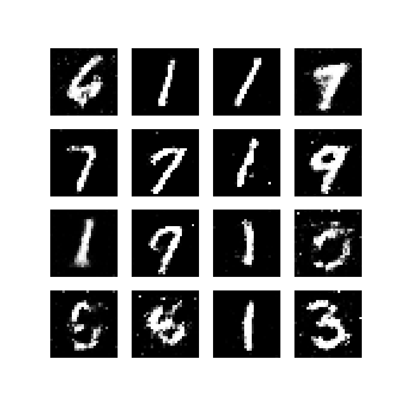

# Звіт по виконанню домашнього завдання

## Мета завдання

Створити просту генеративно-змагальну мережу (GAN) для генерації зображень, використовуючи набір даних MNIST, який складається з рукописних цифр.

## Кроки виконання

### 1. Завантаження та попередня обробка даних

Набір даних MNIST був завантажений за допомогою PyTorch.

Значення пікселів були нормалізовані до діапазону [-1, 1], що покращує стабільність навчання GAN.

```
transforms.Normalize((0.5,), (0.5,))
```

### 2. Створення архітектури генератора

Генератор приймає випадковий шум на вході (вектор розміром 100).

Складається з кількох повнозв'язних шарів із активацією ReLU.

Останній шар використовує активацію tanh, щоб генерувати зображення в діапазоні [-1, 1].

### 3. Створення архітектури дискримінатора

Дискримінатор приймає зображення розміром 28x28.

Використовує кілька повнозв'язних шарів із активацією LeakyReLU.

Останній шар використовує sigmoid для класифікації: чи є зображення реальним чи згенерованим.

### 4. Налаштування втрат та оптимізаторів

Використовувалась функція втрат binary cross-entropy (BCELoss) для обох мереж.

Оптимізатор Adam із коефіцієнтом навчання 0.0002.

### 5. Об'єднання моделей та навчання GAN

Дискримінатор тренується окремо на реальних і згенерованих зображеннях.

Генератор тренується для "обману" дискримінатора.

Навчання виконувалось протягом 50 епох.

6. Оцінка та візуалізація результатів

Згенеровані зображення зберігаються у файлі `output/generated_images.png` після кожної 10-ї епохи.

- Ось кілька прикладів згенерованих цифр після навчання:



Графіки втрат генератора та дискримінатора збережені у файлі `output/loss_plot.png`.


## Результати

### 1. Графіки втрат

Втрати дискримінатора (Discriminator Loss): коливаються навколо 0.5, що вказує на баланс між двома мережами.

Втрати генератора (Generator Loss): поступово зменшуються, що вказує на покращення його здатності генерувати реалістичні зображення.


### 2. Згенеровані зображення

Ось кілька прикладів згенерованих цифр після навчання:


# Підсумки

Ми успішно досягли мети завдання: створено просту генеративно-змагальну мережу (GAN) для генерації рукописних цифр.

## Основні досягнення:

Реалістичність згенерованих цифр поступово покращувалась протягом навчання.

Баланс між генератором і дискримінатором був досягнутий, що підтверджується графіками втрат.

## Що можна покращити:

Використати згорткові нейронні мережі (CNN) замість повнозв'язних шарів для покращення якості зображень.

Збільшити кількість епох для більш детального навчання.

---

# Встановлення та запуск

## Створення та активація середовища

```
./setup_env.sh
source ./_env/bin/activate 
```

## 1. Встановлення необхідних бібліотек

```
pip install torch torchvision matplotlib
```

## Запуск проекту

```
python ./main.py
```